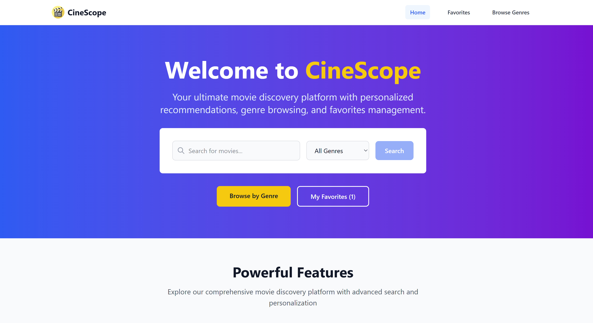
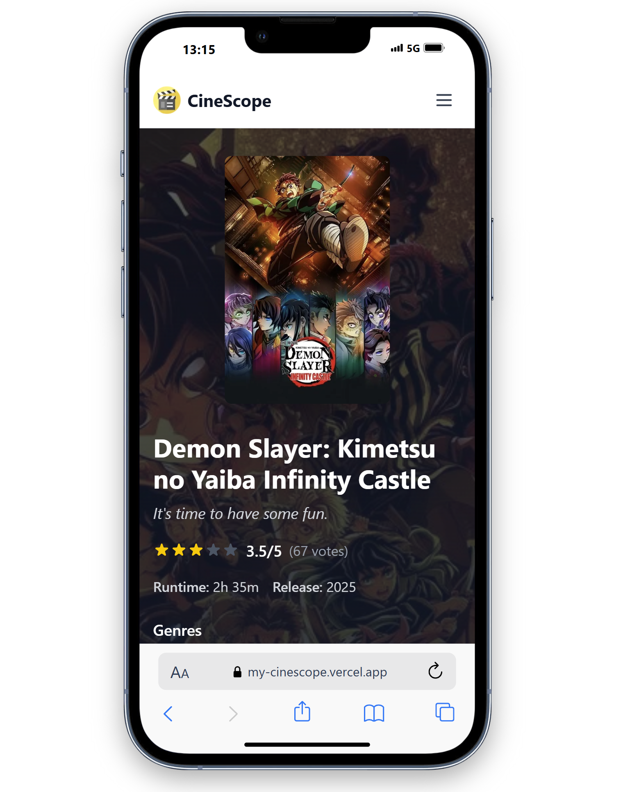
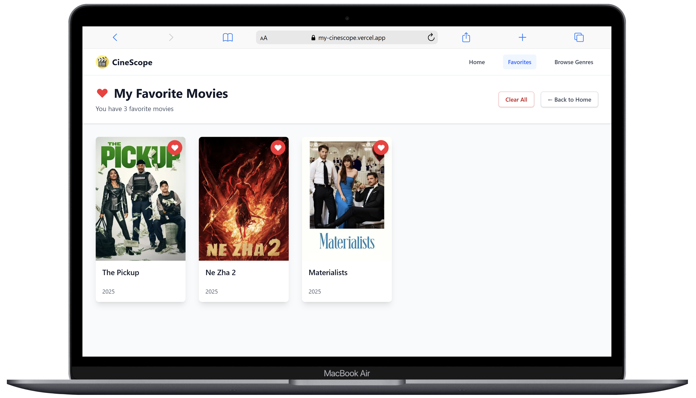

# CineScope - Movie Discovery Platform

A modern, responsive movie discovery application built with Next.js and TypeScript. CineScope allows users to search for movies, browse by genres, manage favorites, and discover trending content using The Movie Database (TMDB) API.

## 🎬 Demo / Screenshots

**Live Demo:** [https://my-cinescope.vercel.app](https://my-cinescope.vercel.app)

### Key Screenshots

- **Homepage:**  
  

- **Movie Details:**  
  

- **Genre Browsing:**  
  

- **Search Results:**  
  

- **Favorites:**  
  

## ✨ Features

### 🔍 Smart Search

- Real-time movie search by title
- Advanced filtering by genre
- Pagination for large result sets
- Responsive search interface

### 🎭 Genre Browsing

- Browse movies by specific genres
- Dynamic genre filtering
- Comprehensive movie collections
- Genre-specific landing pages

### ❤️ Favorites Management

- Add/remove movies from favorites
- Persistent local storage
- Visual favorite indicators
- Dedicated favorites page

### 📈 Trending Discovery

- Real-time trending movies
- Popular content recommendations
- Dynamic content updates

### 🎨 User Experience

- Responsive design for all devices
- Smooth animations and transitions
- Consistent card layouts
- Modern, clean interface
- Accessibility-focused design

## 🛠️ Tech Stack

### Frontend

- **Next.js 14** - React framework with SSR/SSG
- **TypeScript** - Type-safe development
- **TailwindCSS** - Utility-first CSS framework
- **React Hooks** - State management and side effects

### Backend & APIs

- **TMDB API** - Movie data and images
- **Next.js API Routes** - Server-side functionality
- **Axios** - HTTP client for API requests

### Development Tools

- **ESLint** - Code linting and formatting
- **PostCSS** - CSS processing
- **npm** - Package management

## 🚀 Installation & Setup

### Prerequisites

- Node.js (v18 or higher)
- npm or yarn
- TMDB API key

### Installation Steps

1. **Clone the repository**

   ```bash
   git clone <repository-url>
   cd alx-project-nexus
   ```

2. **Install dependencies**

   ```bash
   npm install
   ```

3. **Set up environment variables**

   ```bash
   cp .env.local
   ```

4. **Configure environment variables** (see Environment Variables section)

5. **Run the development server**

   ```bash
   npm run dev
   ```

6. **Open your browser**
   Navigate to [http://localhost:3000](http://localhost:3000)

## 🔐 Environment Variables

Create a `.env.local` file in the root directory with the following variables:

```env
# TMDB API Configuration
NEXT_PUBLIC_TMDB_TOKEN=your_tmdb_token_here
```

### Getting TMDB API Token

1. Visit [The Movie Database](https://www.themoviedb.org/)
2. Create a free account
3. Go to Settings > API
4. Request an API token (v4)
5. Copy your API token to the environment variable

## 📖 Usage

### Basic Navigation

- **Homepage:** Browse trending movies and access main features
- **Search:** Use the search bar to find specific movies
- **Genres:** Click "Browse Genres" to explore by category
- **Favorites:** Access your saved movies via the favorites link

### Search Functionality

```typescript
// Search movies by title
GET /api/search?query=movie_title

// Search with genre filtering
GET /api/search?query=movie_title&genre=action
```

### Favorites Management

- Click the heart icon on any movie card
- Favorites are stored in localStorage
- Access all favorites from the navigation menu

## 📚 API Reference

### TMDB API Endpoints Used

#### Movies

```
GET /movie/{movie_id} - Get movie details
GET /movie/popular - Get popular movies
GET /trending/movie/week - Get trending movies
GET /search/movie - Search movies
GET /discover/movie - Discover movies by genre
```

#### Genres

```
GET /genre/movie/list - Get movie genres
```

### Internal API Routes

#### Search

```typescript
// Search movies
GET /api/search
Query Parameters:
- query: string (required)
- genre: string (optional)
- page: number (optional, default: 1)
```

#### Genres

```typescript
// Get all genres
GET /api/genres

// Get movies by genre
GET /api/genre/[id]
Query Parameters:
- page: number (optional, default: 1)
```

## 🗺️ Roadmap / Future Improvements

### Short Term (v2.0)

- [ ] User authentication and accounts
- [ ] Movie reviews and ratings
- [ ] Watchlist functionality
- [ ] Advanced search filters (year, rating, etc.)
- [ ] Movie trailers integration

### Medium Term (v3.0)

- [ ] Social features (share favorites, reviews)
- [ ] Personalized recommendations
- [ ] Dark/light theme toggle
- [ ] Offline functionality (PWA)
- [ ] Mobile app development

### Long Term (v4.0)

- [ ] AI-powered movie recommendations
- [ ] Integration with streaming platforms
- [ ] Movie discussion forums
- [ ] Advanced analytics dashboard
- [ ] Multi-language support

## 🤝 Contributing

We welcome contributions to CineScope! Here's how you can help:

### Getting Started

1. Fork the repository
2. Create a feature branch (`git checkout -b feature/amazing-feature`)
3. Make your changes
4. Commit your changes (`git commit -m 'Add amazing feature'`)
5. Push to the branch (`git push origin feature/amazing-feature`)
6. Open a Pull Request

### Development Guidelines

- Follow TypeScript best practices
- Use TailwindCSS for styling
- Write meaningful commit messages
- Add comments for complex logic
- Test your changes thoroughly

### Code Style

- Use ESLint configuration provided
- Follow React/Next.js conventions
- Maintain consistent naming conventions
- Keep components small and focused

### Reporting Issues

- Use GitHub Issues for bug reports
- Provide detailed reproduction steps
- Include screenshots when relevant
- Specify browser and device information

## 📄 License

This project is licensed under the MIT License - see the [LICENSE](LICENSE) file for details.

### MIT License Summary

- ✅ Commercial use
- ✅ Modification
- ✅ Distribution
- ✅ Private use
- ❌ Liability
- ❌ Warranty

---

**Built by Rrob-boost**

For questions or support, please open an issue or contact [conatct@mohamed-b.com]

_CineScope - Discover your next favorite movie_ 🎬
